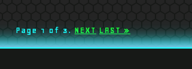
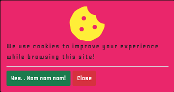
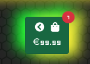
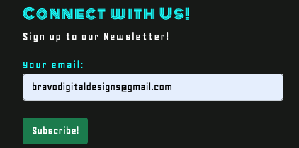

## Table of contents
---- 

- [Overview](#Milestone-Project-4 "Milestone Project 4")  
- [RetroDome](#RetroDome "RetroDome")  
- [User Experience](#user-experience-(ux) "User Experience")  
   - [User Stories](#user-stories "User Stories")  
        - [First Time Visitor Goals](#first-time-visitor-goals "First Time Visitor Goals")  
        - [Returning Visitor Goals](#returning-visitor-goals "Returning Visitor Goals")  
        - [Frequent User Goals](#frequent-user-goals "Frequent User Goals")  
        - [Admin User Goals](#admin-user-goals "Admin User Goals")
- [Design](#design "Design")  
    - [Colour Scheme](#colour-scheme "Colour Scheme")  
    - [Typography](#typography "Typography")  
    - [Imagery](#imagery "Imagery")  
- [Skeleton](#skeleton "skeleton")
    - [Wireframes](#wireframes "Wireframes")
    - [Topology](#topology "Topology")
    - [Django Topology](#django-topology "Django Topology")
    - [Database Schema](#database-schema "Database Schema")  
        - [Models](#models "models")
- [Features](#features "Features")  
- [Technologies Used](#technologies-used "Technologies Used")  
    - [Languages Used](#languages-used "Languages Used")  
        - [HTML5](#html5 "HTML5")  
        - [CSS3](#css3 "CSS3")  
        - [Javascript & JQuery](#javascript/query "Javascript & JQuery")  
        - [Python](#python "Python")
- [Frameworks, Libraries & Programs used](#frameworks-libraries-&-programs-used "Frameworks, Libraries & Programs used")  
    - [Bootstrap v.4.5.3](#bootstrap-v.4.5.3 "Bootstrap v.4.5.3") 
    - [Google Fonts](#google-fonts "Google Fonts")    
    - [Favicon](#favicon "Favicon")   
    - [Figma](#figma "Figma")  
    - [Coolors.co](#coolors.co "Coolors.co")  
    - [jQuery](#jquery "jQuery")  
    - [Git](#git "Git")  
    - [GitHub](#github "GitHub")  
    - [Gitpod](#gitpod "Gitpod") 
    - [AWS](#aws "AWS") 
    - [Heroku](#heroku "heroku")
    - [SQLite3](#sqlite3 "SQLite3")
    - [Stripe](#stripe "Stripe")
    - [Django Debug toolbar](#django-debug-toolber "Django Debug Toolbar")
    - [Django Secret Key generator](#django-secret-key-generator "Django Secret Key generator")
    - [Google Maps](#google-maps "Google Maps")
    - [Lighthouse](#lighthouse "Lighthouse")    
- [Testing](#testing "Testing")  
        - [Testing User Stories from User Experience (UX)](TESTING.md)
    - [Further Testing](#further-testing "Further Testing")  
    - [Known Bugs](#known-bugs "Known Bugs")  
- [Deployment](#deployment "Deployment")   
    - [Local Clone](#local-clone "Local Clone") 
    - [Environment Setup](#2-environment-setup "Environment Setup")
    - [Deployment to heroku](#3-deployment-to-heroku "Deployment to Heroku")
    - [Development](#development "Development")  
    - [Bugs & Feature Requests](#bugs-&-feature-requests "Bugs & Feature Requests")  
- [Credits](#credits "Credits")  
    - [Code](#code "Code")  
    - [Content](#content "Content")  
    - [Media](#media "Media")  
    - [Acknowledgements](#acknowledgements "Acknowledgements")  
# Milestone Project 4 - RetroDome
           
   

This was created to demonstrate learnings from the Code Institute software development course and marks the final of four milestone projects to be created. It utilises HTML, CSS, Javascript, Jquery, Python, Django and UX by way of an interactive full stack e-commerce store for purchasing retro gaming consoles.  

## RetroDome

RetroDome is a website designed for gaming enthusaiasts. Inspired by old style arcades, my childhood and the 'retro' theme of neon lights, dark backgrounds and vibrant colours. It aims to provide an e-commerce store where conosle gaming lovers can go to purchase old and modern gaming conosles from the Sega Megadrive to Nintendo 64 to the latest Xbox! It allows users to add products to their bag, checkout and purchase them and catch up on the latest by way of a blog section. 

For the site owner, it's purpose is to capture user email addresses so as to promote paid for content by way of advertising through newlestters and to make a profit on the mark up of the consoles being sold within the store. 

A live version of the site can be viewed [here](https://retrodome.herokuapp.com).

## User Experience (UX)
### User stories
#### First Time Visitor Goals
* As a First Time Visitor, I want to understand the purpose of the site. 
* As a First Time Visitor, I want to easily navigate through the site.
* As a First Time Visitor, I want to be redirected to the landing page if I navigate to a wrong or broken link.
* As a First Time Visitor, I want to find the site owners social media channels. 
* As a First Time Visitor, I want to see relevant product information at a glance.
#### Returning Visitor Goals
* As a Returning Visitor, I want to make a secure purchase.
* As a Returning Visitor, I want to easily find special offers.
* As a Returning Visitor, I want to find relevant content.
* As a Returning Visitor, I want to engage and be engaged with by the site owners.
#### Frequent User Goals
* As a Frequent User, I want to access the site across a range of devices.
* As a Frequent user, I want to easily sign up and create an account. 
* As a Frequent user, I want to easily see what items I have selected to purchase and be aware of my running total. 
* As a Frequent user, I want to find previous purchases I have made.  
* As a Frequent user, I want to receive confirmation thay my purchase was successful.
* As a Frequent user, I want to filter to a specific category. 
* As a Frequent user, I want to update my delivery information and it be saved. 

#### Admin User Goals
* As an Admin, I want to enable my customers to easily make a purchase.  
* As an Admin, I want to create, edit , update or delete blog posts to keep my users engaged. 
* As an Admin, I want to create, edit, update or delete products. 
* As an Admin, I want my site to be secure from unathorized users. 

### Design
#### Colour Scheme
The site uses the following colours primarily and was inspired by thae arcade classic 'Pac-Man'.   

* Aureolin - rgb(255,240,0) #fff000
* Aqua - rgb(0,255,255) #00ffff
* Electric Green - rgb(0,255,0) #00ff00
* Fuchsia - rgb(248,3,246) #f803f6
* Eerie Black - rgb(24,26,24) #181a18

The following varients were used in a background gradient class and drop shadow classes:
* Dark orange - rgb(255,143,0) #ff8f00
* Winter Sky - rgb(238,38,119) #ee2677
* Mauve - rgb(255,184,255) #ffb8ff

In addition, the site also utilises the following colours for some Bootstrap buttons:   
* btn-success - (Sea Green) - rgb(25,135,84) #198754
* btn-danger - (Rusty Red) -  rgb(220,53,69) #dc3545
* btn-warning -(Indian Yellow) - rgb(240,173,78) #f0ad4e

#### Typography
* [Monoton](https://fonts.google.com/specimen/Monoton) is used on all `<h>` elements and major headings such as the brand logo in the header and footer throughout the site with sans-serif as a fall back in case of errors in loading the font. Monoton was specifically chosen for it's disco retro feel and embodying the theme of the site. 
* [Geo](https://fonts.google.com/specimen/Geo) is used on all other primary elements such as `
`,` ` etc. Geo was specifically chosen as a complimentary font to Monoton due to it's similarity to the typeface used in old school arcade games. 
#### Imagery
The site uses only 2 images natively.
* The fallback image for if no image is available for a product.    

* The brand image of the RetroDome logo is used on Toast messages.  

* All product images used were included within the dataset pulled from [Kaggle](https://www.kaggle.com/) and appear to be pulled from the Gadgets360 cdn. 

### Skeleton
#### Wireframes
    
#### Topology   
 
#### Django Topology
 

Full Wireframes drawn up using Figma can be found [here](https://www.figma.com/file/o5ZNCkRCRwaanJMXHizgif/MS4)

#### Database Schema
#### **Models**
* The project/site uses a relational database. SQLite 3 was used during development and for deployemnt to production the database was migrated to Heroku Postgres. Key models are outlined below:

**Products**
* The products model stores all of the products and categories data for the architecture of the site. 
* The price of each individual product is stored in this model.
* Each product contains a Primary Key PK which is auto generated upon the creation of new product. 
* Images by way of a CDN are stored within this model.

**Newsletter**

* This model allows for a user to register themselves for a newletter subscription. 
* This stores the users email address to the database and is checked against if the user has already subscibed. 

**blog**

* The blog model defines the blogposts to allow for registered users or super users to have CRUD functionlaity. 
* The is model uses the django.contrib.auth user as a foregin key for the author of each blog post. 

**Order**

* The order model creates and stores an instance of the information that should be found within an order. 

**User Profile**

* A user profile model is created for each registered user which stores their information from sign up and their billing information should they opt to do so at point of finalizing their order. 
* This model also utilizes the django.conrib.auth user.

## Features
* The Home page features a number of animations on page load and continous neon animations on the "Shop Now" button and 'RetroDome" brand logo.   
  
* The site uses Django templating to dynamically display products.   

* The Site uses toasts to provide feedback to the user on their actions throughout the site.  

* The site uses defensive programming to prevent unauthorised access to parts of the site that are locked to having an account or an admin permission set by redirecting them to the login page. 
* The site uses a slick animation on the Login page to allow the suer to either signup or login from the page. The same animation is initiated upon load of the signup page so as to replicate the same experience by navigating to either page. Whether on the Login or Sign up page, the user can Login or Create an account. On Mobile, the animation is altered slighlty.   

* The site allows a registered user to create a blog post and edit a blogpost that they have created. Blog posts are ordered in order of newest. The blog post section allows for C.R.U.D functionality for users.   

* The site uses pagination on the both the Products page and the Blog Posts page so as to limit the number of items on a singular page. On the Products page this is limited to 25 per page and 8 per page on the Blog posts page. Pagination was implemented from the Django documentation.   

* The Product page allows for filtering by any of the categories as well as filtering by a number of categories. This is achieved by maniupaliting the href using javascript.    

* For the site user or any user with superuser permissions, they have the ability to edit or delete existing blogposts as well as create,edit or delete products.   

* The site uses a cookie consent toast for cookie consent which remains persistant unless agreed to thanks to some simple Javascript.

* The site features an offcanvas sidebar that auto shows when a product is added to a users bag. This sidebar hides itself automatically after a few seconds.  

* The site features a floating button that shows the above mentioned sidebar to the user at any time which is automatically shown to the user as soon as there is a product in their bag. This keeps a running total of the number of items in the users bag as well as their current spend.  

* The navbar features a search bar which allows users to search for a product. 

* The site's footer features a newsletter subscrtiption which is automatically pre populated with the users details if the user is logged in.  

* The site features a 'contact us' page with a contact form, a google map and contact information for the site owner. Completing the form will send an email to the site administrator with details of the form aswell as submit the form to the asmin site for review. The user is also notified of successfully submitting the form. The form is also pre-populated automatically with the user detials if they are present and the user is logged in. 
 
* The site features a logout page so that the user must confirm that they want to logout and the opiton to remain logged in. This encourages the user to remain for longer.   
 
* The Site features a 404 page with a link to take them back to the home page should they navigate to a broken link.  

* Additionally the site features an error 500 page should the user encounter any internal server errors. 
 
 ### Future features
 Due to massive potential scope creep of the project, a tough decision was made to limit it's features to the minimum basics in the interst of time to meet the project deadline. As such, the following features would be beneficial and implemented in due course. 
 * Commenting/Reviews, had a little more time allowed, this could have easily been implemented on an individual product as it ultimately follows the same logic as the create blog post flow.
 * Star ratings - A logical companion to the review feature above. At present the site only hsows the default ratings which were already present in the dataset that was used. The ability to add a star rating and have the current star rating be dynamically changed and displated based on it's weighting would be a much desired feature and will take some research. 
 * In site admin panel - At present the site owner can only access information on users such as counts, user info and submitted forms by way of the django admin panel. Much of this can easily be rendered to a specific admin section of the site to display this info, statistics as well as mark forms as responded to etc. This is a site in itself and would of consumed much time. 
 * Google analytics for obvious marketing reasons. 
 * Captcha authentiaction for sign up. Appears to be straightforward to implement though time did not allow for it.   

## Technologies Used
### Languages Used
#### [HTML5](https://www.w3schools.com/html/default.asp)
* Html5 and semantic markup is used for the creation of this website.
#### [CSS3](https://www.w3schools.com/css/default.asp)
* CSS is used for styling various elements throughout the site. 
#### [Javascript/JQuery](https://www.w3schools.com/js/default.asp)
* JavaScript and Jquery language is used for development of some front features of the website and activation of Bootstrap features. 
#### [Python](https://www.w3schools.com/python/)
* Python 3 is used as the main application language.
#### [Django](https://www.djangoproject.com/)
* The site is built on the Django framework and uses it's templating throughout.      

### Frameworks, Libraries & Programs Used
#### [Bootstrap v.5.0.0-beta-1](https://getbootstrap.com/) 
* Bootstrap was used throughout the project for it’s responsiveness of the website and styling such as paddings and margins. 
#### [Google Fonts](https://fonts.google.com/)  
* Google fonts were used for the importing of the ‘Monoton’ and ’ Geo’ fonts which is used throughout the entirety of the site.
#### [Favicon]()  
* favIcon was used to create the site favicon.
#### [Figma](https://figma.com/)
* Figma was used to create wireframing.
#### [Coolors.co](https://coolors.co/)
* Coloors was used to assist with choosing the colour scheme that is used throughout the website.
#### [jQuery](https://www.w3schools.com/jquery/default.asp)
* jQuery was used in select few places.
#### [Git](https://git-scm.com/)
* Git was used for version control by utilizing the Gitpod terminal to commit to Git and Push to GitHub.
#### [GitHub](https://github.com/)
* GitHub is used to store the projects code after being pushed from Git.
#### [Gitpod](https://gitpod.io/)
* Gitpod was used as the primary IDE for development of the site.    
#### [AWS](https://aws.amazon.com/)
* Amazon web Services (AWS) is used for the storage of all media and static files for the production environment. 
#### [Heroku](https://www.heroku.com/postgres)
* Heroku Postgres is used as the core database for the production environment.  
#### [SQLite3](https://www.sqlite.org/index.html)
* SQLite 3 is used as the core database for the development environment.  
#### [Stripe](https://stripe.com/ie)
* Stripe and it's webhooks are used to manage and process payments. 
#### [Django Debug Toolbar](https://django-debug-toolbar.readthedocs.io/en/latest/)
* Django Debug Toolbar was used throughout development for it's debugging capabilites. 
#### [Django Secret Key generator](https://miniwebtool.com/django-secret-key-generator/)
* Django Secret key generator from miniwebtool was used to generate a new SECRET_KEY for the environment variables. 
#### [Google Map's](https://www.google.com/maps)
* Google Maps was used to generate the iframe used for the embedded map found on the contact page. 
#### [Lighthouse](https://developers.google.com/web/tools/lighthouse)
* Lighthouse, a Google Web Dev tool, was used extensively for testing performance, accessability, best practices and SEO of the site in it's entirety.

## Testing
The W3C Markup Validator and W3C CSS Validator Services were used to validate every page of the project to ensure there were no syntax errors in the project. Whilst the W3C CSS validationr eturned no errors, W3C Markup did return numeros errors that appear to be largely related to not recognising the flask jinja templating. Every effort was made to rectify these issues though time did not permit the fixing of them. 

* [PEP8Online.com](http://pep8online.com/) was used for validating all Python code and passed validation. 

* All links have been extensively tested to ensure correct continuity.

### Testing User Stories from User Experience (UX)
Due to the extensiveness of testing User Stories. It's contens where moved to and can be found in [TESTING.MD file](TESTING.md)

#### Further Testing
Lighthouse, a Google Chrome web developement tool, was used extensively on the site in it's entirety. Every individual page was tested for desktop and mobile and received a score of average low to mid 90's across Performance, Accessability, Best Practices and SEO. The lowest score was 73 for Performance and the highest was 100 for best practices.   
    
A copy of the Lighthouse report for each individual page can be found below:    
* Index - [Lighthouse Desktop Result](mdassets/pdf/index-lighthouse-report-desktop.pdf) | [Lighthouse Mobile Result](mdassets/pdf/index-lighthouse-report-mobile.pdf)
* reviews - [Lighthouse Desktop Result](mdassets/pdf/reviews-lighthouse-report-desktop.pdf) | [Lighthouse Mobile Result](mdassets/pdf/reviews-lighthouse-report-mobile.pdf)
* signup - [Lighthouse Desktop Result](mdassets/pdf/signup-lighthouse-report-desktop.pdf) | [Lighthouse Mobile Result](mdassets/pdf/signup-lighthouse-report-mobile.pdf)
* contact - [Lighthouse Desktop Result](mdassets/pdf/contact-lighthouse-report-desktop.pdf) | [Lighthouse Mobile Result](mdassets/pdf/contact-lighthouse-report-mobile.pdf)
* privacy - [Lighthouse Desktop Result](mdassets/pdf/privacy-lighthouse-report-desktop.pdf) | [Lighthouse Mobile Result](mdassets/pdf/privacy-lighthouse-report-mobile.pdf)

#### Known Bugs
* During the devlopment cycle, an issue was found when attempting to load the fixtures of the database. The JSON format of the product and category files was checked, doubled checked and checked again by student support adn it was found that the JSOn format was indeed as it should be. After much bouncing back and forth with student support, sharing of the workspace, reading of documentation and extensive StackOverflow reasearching. The developer found that the following line of code resolved the issue from within the gitpod terminal:    

                python3 manage.py loaddata products --ignorenonexistant

    The '--ignorenonexistant' flag ignores values that do not exists within the JSON file as some of the dataset used did   not have all fields completed. An alternative resolution is to manually update the JSON file to add data to all fields that did not exist.    

* When creating and testing the newsletter form within the footer. A critical bug was found whereby submitting another form such as the contact us form would submit the newsletter form in it's place. This was due to the fact that both forms contained and where referenced as the email field. To circumvent this, the newsletter from was given a custom name in the newsletter.models.py file:

                custom_names = {'email': 'newsletter_email'}

    This was then further built upon within an if statement in the newsletter.contexts.py:

                if 'newsletter_email' in request.POST:

* On the products page, the filtering option that was added intorduced two known bugs:
    1. Having selected a category or categories to filter from, the checkboxes that are selected after applying the filter are not known to the user. There are a few ways in which this could be fixed. In hindsight, utilizing django's filtering capabilites woul have been a better method to implement this feature. As a quick fix, some javascript could be written to resolve this. Should time allow to implement this before submission then it shall be done. 
    2. Shoudld the results of filtering exceed the pagination limit of 25 then navigating to a second page removes the filtering and simply brings you to page two of the products. 

* Nevigating from the home page to the the specific Handheld Consoles category includes some Home Consoles in the results. It is believed that this issue may lie within the fixtures though time did not permit to explore the bug further and so is unresolved. 

* A media query needs to be implemented for rendering the index page on original iPads in portrait mode as they casue the footer to be squeezed. 

## Deployment

The website was created using Gitpod IDE. GitHub was used for hosting the repository and the environment is then deployed to Heroku for hosting. The following are the steps needed to set up your IDE, clone the repository and deploy to Heroku. In addition to those listed, AWS is used for storing of the static files and media files. SQL Lit3 is used for the DB in development. 

### 1. Clone the Repo
#### Local Clone
1. Navigate to the GitHub Repository: [Milestone Project 4 - RetroDome ](https://github.com/LogisticBravo/retrodome)
2. Click the Code drop down menu.
3. Either Download the ZIP file, unpackage locally and open with IDE (This route ends here) OR Copy Git URL from the dialogue box.
4. Open your developement editor of choice and open a terminal window in a directory of your choice.
5. Use the 'git clone' command in terminal followed by the copied git URL.    

        git clone https://github.com/LogisticBravo/retrodome
6. A clone of the project will be created locally on your machine.

### 2. Environment Setup
1. Install requirements.txt via your IDE terminal window for dependencies and external libraies. *Important 

        pip3 install -r requirements.txt 
   
2. Ensure that  "`env.py`" is added to your `gitignore` file. 
3. Ensure that your `Procfile` (case sensitive) is present. On the off chance that it is not:

        touch Procfile
    within it add the following:

        web: gunicorn YOUR_APP_NAME.wsgi:application
4. Ensure that the above steps have been completed succesffully before proceeding to deployment. 
5. Stage, commit and push your local repo to GitHub.

        git add -A
        git commit -m "Initial Commit"
        git push

### 3. Deployment to Heroku
1. If you haven't already, Create an account and login to [Heroku](https://signup.heroku.com/).
2. Create a new app and give it a unique new name. Importance on unique as Heroku will flag if it's already taken. For simplicity, it's suggested to keep this aligned to your GitHub repository.
3. Choose from the available Shard options - EU or US - It's best to select closest to your location.
4. Navigate to App settings > 'Config Vars'
5. Replicate your envrionment variables and ensure they match exactly.    

    * AWS_ACCESS_KEY_ID
    * AWS_SECRET_ACCESS_KEY
    * DATABASE_URL
    * EMAIL_HOST_PASS
    * EMAIL_HOST_USER
    * SECRET_KEY
    * STRIPE_PRICE_ID
    * STRIPE_PUBLIC_KEY
    * STRIPE_SECRET_KEY
    * STRIPE_WH_SECRET
    * USE_AWS

6. Add Heroku Postgres Database:

    -- Click the resources tab in heroku.    
    -- Under Add-ons search for heroku postgres.    
    -- Click on heroku postgres when it appears.    
    -- Select the Hobby Dev-Free option in plans.    
    -- Click submit order form. 

7. Create and connect an AWS S3 account:

    7.1 - If you don't already have one, create an AWS account.    
    7.2 - Using the search field, search S3 and create a new bucket.    
    * Select Allow public access.  

    7.3 - from the 'Properties' section:    
    * Select Static Website Hosting and enable it.    
    * Set 'index.html' as index.html.   
    * save and exit.

    7.4 - Navigate to Permissions > CORS and paste in the following:

                    [
                        {
                            "AllowedHeaders": [
                            "Authorization"
                    ],
                            "AllowedMethods": [
                            "GET"
                    ],
                            "AllowedOrigins": [
                            "*"
                    ],
                            "ExposeHeaders": []
                        }
                    ]
    7.5 - Still in the Permissions section, sekect 'Bucket policy':
    * Generate Bucket Policy and take note of Bucket ARN
    * Chose S3 Bucket Policy as Type of Policy
    * For Principal, enter *
    * Enter ARN noted above
    * Add Statement
    * Generate the Policy
    * Copy the Policy JSON Document
    * Paste the policy into Edit Bucket policy from the previous tab
    * Save changes    
    7.6 From the Access Control List section, ensure the following:
    * Tick 'List' for Everyone (public access).
    * Save changes.
8. Still within AWS, search for AWS IAM (Identity and Access Management).    
    8.1 - Navigate to the AWS IAM Dashbaord and create a new group.    
    8.2 - From policies, do the following:
    * Create a policy.   
    * Under JSON tab > click Import managed policy.   
    * Choose AmazonS3FullAccess.   
    * Edit the resource to include the Bucket ARN noted earlier when creating the Bucket Policy.   
    * Click next > Review policy.   
    * name the policy and enter a description of your chooisng.   
    * Create policy.

    8.3 - Navigating back to the User Group section > choose the earlier created group.
    * From Permissions select Add Permissions and attach the policy from the previous step. 
    * Add the permissions.
    8.4 - Under Users:
    * Choose a user name.   
    * Select Programmatic access as the Access type.   
    * Click Next.   
    * Add the user to the Group just created.   
    * Click Next and Create User.  
    8.5 - Download the .csv file that contains the access and secret access keys.    
    * N.B. You can only download this file once and will not be available again so ensure you do not loose it.   
    8.6 - Refer to earlier steps 4 and 5 to add these to your environment variables within Heroku.       

9. From Heroku App deploy page:
    -- Choose GitHub from the Deployment Method.    
    -- Hit "Connect to GitHub".    
    -- Log in to your GitHub from Heroku to link the App to GitHub.    
    -- Search for and select the repository to be linked in Github.    
    -- Hit Connect.    
    -- Choose Enable Automatic Deployment from the GitHub Master / Main branch.        
    
10. Open the App to confirm deployment. Note that Heroku can be slow to open on the first instance. 
  

### Development
We welcome all contributions. To do so:

1. Fork the Repo.
2. Log in to GitHub and locate the [Respository](https://github.com/LogisticBravo/retrodome).
3. At the top of the Repository (not top of page) just above the "Settings" Button on the menu, locate the "Fork" Button.
4. You should now have a copy of the original repository in your GitHub account.	
5. Create a new branch.
6. Make your changes and ensure adequate testing with supporting documents.
7. Adhere accordingly to the existing style. 
8. Commit often with clear commit messages.
9. Push to the branch.
10. Create a pull request.

### Bugs & Feature Requests

Should you find a bug and want to help us squash it. Please open an issue [here](https://github.com/LogisticBravo/retrodome/issues/new) ensuring you add the '**bug**' label  with clear detail under the following:
* What you done?
* Where you done it?
* What you expected to happen?
* What actually happened?
	
To request a new feature or function then please open an issue [here](https://github.com/LogisticBravo/retrodome/issues/new) ensuring you add the '**enhancement**' label  with proposed changes including snippets of how to do so.

## Credits

### Code
* Bootstrap 5.0.0-beta-1: Bootstrap Library used throughout the project mainly to make site responsive using the Bootstrap Grid System and classes for padding, margins etc.
* CSS Styling code and corresponding classes/id’s was largely that of the developer. Additional code is commented within the stylesheet itself.
* With the exception of what was inherited from the Boutique Ado walkthrough project, all Javascript and Jquery code is that of the developer.
* A significant amount of code for handling orders, stripe wbhooks and it's implementation was adapted from the Boutique Ado walkthrough project. 
* Django templating and it's logic is that of the developer. 
* Whilst all code for the implemntation of the signup and login page was that of the developer. The concept and .bg-colorgradient class was insipred by [Florin Pop](https://www.florin-pop.com/blog/2019/03/double-slider-sign-in-up-form/)

### Content
* The layout and concept were entirely that of the the developer Jay Bradley. 
* The dataset used for the products population was pulled from [Kaggle](https://www.kaggle.com/deepann/4000-laptops-data-from-gadgets360)

### Media
* The images for each of the products were already included within the dataset and are pulled from gadgets360 cdn.
* The image for the brand logo of RetroDome was created by screenshotting the logo itself after it had been created and styled by the developer. 

### Acknowledgements
* First and foremost, most importantly, my amazing wife, Lyndsey! For her continued support during the last 12 months, for her understanding of the effort and energy being put into this coursework. For single handedly managing a testing 4 year old on the toughest of days and proving dada with breathing room to put the head down and continue working. For her motivation when I felt that I could not get this final project over the line and pushing me to succeed. For continously checking in and being a staple in the possibility of achieveing the last 12 months. None of this would be possible without your love, care and support! Thank you!!
* A very special thanks to 'Alexander' of Code Institute student support for checking in, sharing resources, being understanding and giving me hope to continue.
* My fellow classmates of the springboard cohort, we've shared frustrations, we've shared celebrations. We were always there to bounce ideas and problems off and we understood one another. I hope that our paths cross again in the future.
* My work Colleague and fellow developer John O' Donoghue for breaking the site when I asked him to and giving some great feedback.
* My workplace for being understanding of my personal goals and providing time off to achive them without issue or question. 
* [CSS Tricks](https://css-tricks.com/) for being a great place for inspiration and knowledge.
* [W3 Schools](https://www.w3schools.com/) for the wealth of information thats available.
* [Django documentation](https://docs.djangoproject.com/en/3.2/) for all things related with troubleshooting. 
* [Stack Overflow](https://stackoverflow.com/) for always having something that would put you on the right track. 
* [Code Institute](https://codeinstitute.net/) for amazing coursework and a well structured learning environment.For challenging me beyond my limits and opening my up my inspiration. The course is intense and that is an understatement however it truly delivers on what it promises and regardless of the outcome of this project I thank Code Institute for the opportunity to be a part of it and inspiring me to continue to learn. 