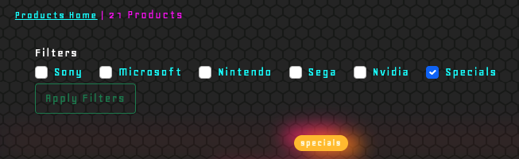

# Contents

- [Testing User Stories](#testing-user-stories "Testing User Stories")
    - [First Time Visitor Goals](#first-time-visitor-goals)
        - [Test Case 1](#test-case-1 "Test Case 1")
        - [Test Case 2](#test-case-2 "Test Case 2")
        - [Test Case 3](#test-case-3 "Test Case 3")
        - [Test Case 4](#test-case-4 "Test Case 4")
        - [Test Case 5](#test-case-5 "Test Case 5")
    - [Returning Visitor Goals](#returning-visitor-goals)
        - [Test Case 6](#test-case-6 "Test Case 6")
        - [Test Case 7](#test-case-7 "Test Case 7")
        - [Test Case 8](#test-case-8 "Test Case 8")
        - [Test Case 9](#test-case-9 "Test Case 9")
    - [Frequent Visitor Goals](#frequent-visitor-goals)
        - [Test Case 10](#test-case-10 "Test Case 10")
        - [Test Case 11](#test-case-11 "Test Case 11")
        - [Test Case 12](#test-case-12 "Test Case 12")
        - [Test Case 13](#test-case-13 "Test Case 13")
        - [Test Case 14](#test-case-14 "Test Case 14")
        - [Test Case 15](#test-case-15 "Test Case 15")
        - [Test Case 16](#test-case-16 "Test Case 16")
    - [Admin User Goals](#admin-user-goals "Admin User Goals")
        - [Test Case 17](#test-case-17 "Test Case 17")
        - [Test Case 18](#test-case-18 "Test Case 18")
        - [Test Case 19](#test-case-19 "Test Case 19")
        - [Test Case 20](#test-case-20 "Test Case 20")

## Testing User Stories
### First Time Visitor Goals
#### Test Case 1

> As a First Time Visitor, I want to understand the purpose of the site.    

**Description**
Verify that the site's purpose is clear to a user when they land on the landing page of the site.

**Steps**
1. Open your browser of choice.
2. Navigate to [https://retrodome.herokuapp.com/](https://retrodome.herokuapp.com/)
3. Confirm a welcome message scrolls into view making the sites intention clear.

**Expected Result:**
A 'h2' element proceeded by a 'p' element should be present outlining the purpose of the site. 

**Actual Result:**
A 'h2' element proceeded by a 'p' element is present outlining the purpose of the site.

**Pass/Fail:**
Pass

**Image of Test Result:**  
    

#### Test Case 2

> As a First Time Visitor, I want to easily navigate through the site.    

**Description**
Verify that the site contains an intuitive navigation menu.

**Steps**
1. Open your browser of choice.
2. Navigate to [https://retrodome.herokuapp.com/](https://retrodome.herokuapp.com/)
3. If on mobile, a 'Hamburger' icon will be present and require tapping.
4. On larger devices, confirm that the sites navigation links are present in the navbar.
5. On larger screens confirm that a colourful display lists links to be navigated to. 
6. Navigate to the products page and confirm that the current page is highligted as acitve in the Navbar.
7. Navigate through all site links to ensure continuity.
8. Create an account, log in and repeat the above steps. 
9. Confirm that the links within the colourful display on the index page are dependant on a user logged in or not.
10. Confirm that the contact us link in the footer works.

**Expected Result:**
 - When visiting the site, the Navbar should contain a clearly defined navigation menu. 
 - The footer should contain a 'Contact us' link
 - The current active page should be highlighted in the navbar.
 - The links in the green diamonds of the home page are dependant on if a user is logged in or not.  

**Actual Result:**
 - When visting the site, the navbar is clearly present and is familiar to the user. 
 - When on mobile, a "hamburger" icon is present and is familiar to the user. Tapping this reveals the navigation links. 
- The navigation menu remains consistent throughout site navigation. 
- When logged in the diamonds on the home page display 'My bag" and "Logout" as opposed to "Sign In" and "Sign Up". The profile link becomes visible to the user also.  
- The current active page is highlighted with #00ffff.  

**Pass/Fail:**
Pass

**Image of Test Result:** 

    

#### Test Case 3

> As a First Time Visitor, I want to be redirected to the landing page if I navigate to a wrong or broken link.    

**Description**
Verify that the site contains a 404 page that is evident to the user they have navigated to a wrong or broken link. Verify that the page directs the user to return to the homepage.

**Steps**
1. Open your browser of choice.
2. Navigate to [https://retrodome.herokuapp.com/404](https://retrodome.herokuapp.com/404)
3. Alternatively, navigate to [https://retrodome.herokuapp.com/YOUR_RANDOM_STRING](https://retrodome.herokuapp.com/YOUR_RANDOM_STRING)
4. Confirm that the page states it is a 404 page and that something went wrong. 
5. Confirm that it directs the user to return to the Home page.
6. Confirm that the link to the Home page returns the user to the Home page. 
7. Create and account, login and repeat the above steps.

**Expected Result:**
 - When visiting a wrong or broken link, the user should land on a 404 page that is clearly defined. 
 - It should feature a button that directs the user to "Home".
 - Clicking the button should return the user to the Home page. 
 - The expected result should take place regardless of the user being signed in or not.

**Actual Result:**
 - When navigating to [https://retrodome.herokuapp.com/404](https://retrodome.herokuapp.com/404) or [https://retrodome.herokuapp.com/YOUR_RANDOM_STRING](https://retrodome.herokuapp.com/YOUR_RANDOM_STRING) a clearly defined 404 page is displayed to the user which states that something went wrong. 
 - The 404 page displays a button directing the user to "Home".
 - Clicking this button returns the user to the Home Page.
 - The same happens regardless of the user being signed in or not.

**Pass/Fail:**
Pass

**Image of Test Result:**  

#### Test Case 4

> As a First Time Visitor, I want to find the site owners social media channels.    

**Description**
Verify that the site contains 3 established social media icons in the footer. Verify that clicking these icons directs the user to the associated social media channel in a new tab. 

**Steps**
1. Open your browser of choice.
2. Navigate to [https://retrodome.herokuapp.com/](https://retrodome.herokuapp.com/)
3. Confirm that there are 3 recognisable social media icons within the footer of the site.
4. Hover over each icon to confirm that the currently selected one is made aware to the user by way of the cursor changing to a pointer.
5. Click each social media icon respectively and confirm that each opens up to the related social media channel in a new tab. 

**Expected Result:**
 - When visiting the site there should clearly be branded social media icons in the footer. 
 - When hovering on these icons the cursor should be changed to a pointer alerting the user that it is the current icon they are hovering. 
 - Clicking the respective icons should open the related social media channel in a new tab. 

**Actual Result:**
 - When visiting the site there is clearly 5 branded icons in the footer.
 - When hovering the icons, the cursor changes to a pointer alerting the user that it is the current icon being hovered upon. 
 - Clicking the respective icons opens up the associated social media channels in a new tab in the browser. 

**Pass/Fail:**
Pass

**Image of Test Result:**  

#### Test Case 5
> As a First Time Visitor, I want to see relevant product information at a glance.
**Description**
 Verify that when on the products page there is a dropdown table on all products that when dropped down contains the relevant information to the product.  

**Steps**
1. Open your browser of choice.
2. Navigate to [https://retrodome.herokuapp.com/products](https://retrodome.herokuapp.com/products)
3. Select a Product of your choosing and press the cheveron icon beside 'Specifications'.
4. Observe that this drops down a table revealing all of the relevant information of the product. 
5. Scroll to the bottom of the table and observe that the price is displayed.  

**Expected Result:**   
The following should be visible to a user on all products:
 - A cheveron denoting that the table drops down beside the word 'Specifications'.
 - A dropwdown table should dropdown revealing the following information table:
    * About
    * Body
    * Memory
    * Technical
    * Comms
 - Beneath this a rating and the price for the product should be displayed. 

**Actual Result:**
- Navigating to the products page displays a cheveron beside the word 'Specifications' on all products.
- Selecting this cheveron reveals a table with all of the relvant product information. 
- Beneath this information is a rating and a price for the product. 

**Pass/Fail:**
Pass

**Image of Test Result:**  
    
  
    

### Returning Visitor Goals
#### Test Case 6
> As a Returning Visitor, I want to make a secure purchase.    

**Description**   
Verify that the site allows for the purchase of products using a secure credit card system. 

**Steps**
1. Open your browser of choice.
2. Navigate to [https://retrodome.herokuapp.com/products](https://retrodome.herokuapp.com/products)
3. Select a product of your choosing by clicking on it's image. 
4. Scroll down and select the 'Shopping trolley' icon to add it to your bag. 
5. By clicking the green bag icon at the top right, open your shopping bag sidebar and select 'Checkout'. 
6. Complete the form with delivery information. 
7. Use the following detials for the credit card:
    * 4242 4242 4242 4242 as the CC number.
    * Any exiry date in the future. 
    * Any 3 digit CVC Number.
    * Any 5 digit ZIP code     
6. Hit the 'Complete Order' button.
7. Pay careful attention to the bottom left off the screen an observer the 'conencting to api.stripe' message from the browser. 
8. Confirm you land on a checkout success page. 

**Expected Result:**
The checkout system will work in a familiar way to the user and they will be presented with a 'Checkout Success' page confirming their order was submitted.

**Actual Result:**
The checkout sytem is familiar and the user is directed to a 'Checkout Success' page confirming that the order was submitted. 

**Pass/Fail:**
Pass

**Image of Test Result:**  
    
    
   
    
    
    

#### Test Case 7
> As a Returning Visitor, I want to easily find special offers.    

**Description**   
Vaerify that on the home page on large screens that there is a specific callout for 'Specials'. Otherwise, and on mobile, verify that the filter option on the 'Products' opage returns products with the 'Specials' label.

**Steps**
1. Open your browser of choice.
2. Navigate to [https://retrodome.herokuapp.com/](https://retrodome.herokuapp.com/)
3. Observe that there is a specific callotu for the 'Specials' if on a large screen.
4. Click this to be taken to all products with the 'Specials' label. 
5. Otherwise, and on mobile, navigate to the 'Products' page and selct the 'specials' tickbox under the Filters section. Select 'Apply filters'. 
6. Verify that it returns products that have the specials label. 

**Expected Result:**    
The user should see a 'Specials' callotu diamon on the home page on large screens. On smaller screens such as mobile the user should be able to filter to specials using the filtering option. The returned results should all be labelled 'Specials'. 

**Actual Result:**    
There is a specific callout to the 'Specials' section on the home page. Navigating to the products paage also shows a filtering option for 'Specials'. Selcting and appling this filter returns all products that are labelled 'Specials'. 

**Pass/Fail:**
Pass

**Image of Test Result:**  
    
    
    

#### Test Case 8

> * As a Returning Visitor, I want to find relevant content.    

**Description**   
Verify that site contains a blog posts page with blog content. 

**Steps**
1. Open your browser of choice.
2. Navigate to [https://retrodome.herokuapp.com/blog](https://retrodome.herokuapp.com/blog)
3. Verify that there are blog posts posts relating to game consoles in cards.
4. Verify that clicking 'Continue reading' takes you through to the full blog content.  

**Expected Result:**    
Navigating to the blog post page should display blog posts in a card view format. Each blog post should display a preview of it's content. Clicking on 'Continue reading' should take the user through to the full blog post entry. 

**Actual Result:**    
Navigating to the blog post displays blog posts in a card view format. Each blog displays a preview of it's content. Clicking on 'Continue reading' takes the user through to the full blog post entry. 

**Pass/Fail:**
Pass

**Image of Test Result:** 
    
    

#### Test Case 9

> As a Returning Visitor, I want to engage and be engaged with by the site owners.  

**Description**   
Verify that in the footer is a newsletter subscription field and a contact us page with relevant contact information and a contact us form. Verify that submitting the form returns a toast message that it was submitted.

**Steps**
1. Open your browser of choice.
2. Navigate to [https://retrodome.herokuapp.com/](https://retrodome.herokuapp.com/)
3. Navigate to the footer.
4. Observe the Newsletter subscription field and enter your email (If the user is signed in this will be pre-populated)
5. Submite the form and confirm that a toast success is received. 
6. Staying in the footer, click on the 'Contact Us' link and confirm it navigates to a contact us page. 
7. Observe the relevant contact details and a Contact form. 
8. Enter the relevant details and a message on the contact form and observe a toast message upon it's submission. 

**Expected Result:**    
Navigating to the sites footer should show a Newletter form which can be submiited and the user should receive confirmation of it's submission. Navigating to the contact us page should present the user with a contact us form and relevant contact details. Submitting the form should display a toast message to the user confirming it's submission.    

**Actual Result:**    
Navigating to the sites footer show's a Newletter form which can be submiited and the user receives confirmation of it's submission. Navigating to the contact us page presents the user with a contact us form and relevant contact details. Submitting the form displays a toast message to the user confirming it's submission. 

**Pass/Fail:**
Pass

**Image of Test Result:**  
    
    
    
    

### Frequent Visitor Goals
#### Test Case 10

> As a Frequent User, I want to access the site across a range of devices.  

**Description**   
Verify that the site is responsive across a range of media devices. Confirm that everything is clearly visible and accessible.  

**Steps**
1. Open Google Chrome browser.
2. Navigate to [https://retrodome.herokuapp.com/](https://retrodome.herokuapp.com/)
3. Using Chrome Dev tools (F12 on your keyboard)
4. Select the "Toggle Device Toolbar" icon (CMD Shift M on a mac).
5. Using the dropdown menu to select a range of device sizes. 
6. Test every page of the website using this method across different device selections.

**Expected Result:**     
When navigating the website through different devices all elements, modals, forms etc. should visible and clear. Confirm that the UI of the site maintains it's structure across various screen sizes. 

**Actual Result:**    
The site is responsive across Desktops, tablets and mobile devices and was tested using Chrome Developer tools on Ipad, Ipad Pro, Iphone 6,7,8 X, Xiaomi F2, Xiamoi F1, Mac pro, MacBook and Safari and Chrome browsers. Though still responsive, the home page does pose a minor positioning issue on original ipads.

**Pass/Fail:**
80% Pass due to some placement issues of the homempage on an ipad.

**Image of Test Result:**  

#### Test Case 11

> As a Frequent user, I want to easily sign up and create an account.    

**Description**      
Verify that the site allows a user to easily creata na account or login if they already have an account. 

**Steps**
1. Open your browser of choice.
2. Navigate to [https://retrodome.herokuapp.com/](https://retrodome.herokuapp.com/)
3. From either the navbar > accounts > login or alternatively select the login or signup callout from the home page. 
4. Complete the sign up form to create an account. 
5. Observe the signup toast noting that a confirmation email has been sent and the verify email address page.
6. Check the email address that was used ibox and confirm the email address. 
7. Once confirmed, navigate to the the login page.
8. Login with the credentials that were just created.
9. Observe the sign in success toast and verify that you are now logged in by navigating to the accounts dropdown in the navbar and observing the logout option. 

**Expected Result:**    
When signing up a sign up form will be displayed to the user and upon it's completion will be presented with a toast acknowledging that they should receive a confirmation email. The web page also note that the email address must be verified. The user will receive an email and verifying through the link will successfully create their account. The user should be able to login with the new account that has been created. 

**Actual Result:**
When signing up a sign up form is displayed to the user and upon it's completion the user is presented with a toast acknowledging that they should receive a confirmation email. The web page also notes that the email address must be verified. The user did receive an email and verifying through the link did successfully create their account. The user can now login with the new account that has been created. 

**Pass/Fail:**
Pass

**Image of Test Result:**    
    
    
    

#### Test Case 12

> As a Frequent user, I want to easily see what items I have selected to purchase and be aware of my running total.    

**Description**   
Verify that adding an item to your cart automatically shows the sidebar 'Shopping bag'. Verify that a button is automatically shown to the user which shows a running total of items in their bag and a running total cost. Verify that selecting this button brings up the sidebar 'Shopping bag'.

**Steps**
1. Open your browser of choice.
2. Navigate to [https://retrodome.herokuapp.com/](https://retrodome.herokuapp.com/)
3. Navigate to products section. 
4. Select a product of your choosing. 
5. Confirm that the shopping bag sidebar shows and that the shopping bag button is also shown.
6. Confirm that the shopping bag button contains a running total of items by way of a badge and total cost. 
7. Confirm that clicking this button brings up the shopping bag sidebar. 
8. Confirm the shopping bag contains the items that were added to the bag a total cost at the bottom. 

**Expected Result:**    
Adding a product to the bag should bring up the sidebar shopping bag which in itself should show a running total of the cost of items. A green button with a shopping bag icon should also be automatically shown that is now fixed to the page to the user. This button should bring up the sidebar shopping bag. The button should also show a running total cost as well as total mumber of items by way of badge.

**Actual Result:**    
Adding a product to the bag does bring up the sidebar shopping bag which in itself shows a running total of the cost of items. A green button with a shopping bag icon is also automatically shown that is now fixed to the page to the user. This button bring's up the sidebar shopping bag. The button also shows a running total cost as well as total mumber of items by way of badge.

**Pass/Fail:**
Pass

**Image of Test Result:**    
    
    

#### Test Case 13

> As a Frequent user, I want to find previous purchases I have made.    

**Description**    
Verify that a user can easily access their previous order history and it's details. 

**Steps**
1. Open your browser of choice.
2. Navigate to [https://retrodome.herokuapp.com/](https://retrodome.herokuapp.com/)
3. Login with an account that has previous purchases made on it. 
4. From the Navbar go to Account > My Profile. 
5. Observe the order history summary on the right hand side. 
6. Click on the order number to be taken to the details of the order history. 
7. Observe the order history and toast advising of a previous order. 

**Expected Result:**    
Logging in on an account with a previous purchase on it should allow the user to find their previos orders by navigating to Accounts > My Profile and seeing a summary of previous orders on the right hand side. Selecting an order number from this list should take the user to a detailed page outlining the order history and display a toast advising that it is a previous order. 

**Actual Result:**    
Logging in on an account with a previous purchase on it allows the user to find their previos orders by navigating to Accounts > My Profile where a summary of previous orders can be seen on the right hand side. Selecting an order number from this list takes the user to a detailed page outlining the order history and displays a toast advising that it is a previous order. 

**Pass/Fail:**
Pass

**Image of Test Result:**  
    
    
    

#### Test Case 14

> As a Frequent user, I want to receive confirmation thay my purchase was successful.    
**Description**  
Verify that when a user makes a purchase that it goes through succesffully.

**Steps**
1. These steps taken were covered in [Test Case 6](#test-case-6 "Test Case 6") above. Please refer back to test Case 6.

**Expected Result:**    
The user will be displayed with a checkout success page and a checkout success toast. 

**Actual Result:**    
The user is presented with a checkout success page and a checkout success toast. 

**Pass/Fail:**
Pass

**Image of Test Result:** 
    

#### Test Case 15

> As a Frequent user, I want to filter to a specific category.    

**Description**      
Verify that a user can easily filter the prdocuts to any of the available categories.    

**Steps**
1. These steps taken were covered in [Test Case 7](#test-case-7 "Test Case 7") above. Please refer back to test Case 7.

**Expected Result:**    
The user should be able to filter the products down using the filtering feature to any of the available categories.  

**Actual Result:**    
The user can filter the products down using the filtering feature to any of the available categories.

**Pass/Fail:**
Pass

**Image of Test Result:**  
    

#### Test Case 16

> As a Frequent user, I want to update my delivery information and it be saved.    

**Description**  
Verify that a user can update their default delivery information and that it is available at the next purchase. 

**Steps**
1. Open your browser of choice.
2. Navigate to [https://retrodome.herokuapp.com/](https://retrodome.herokuapp.com/)
3. Login with an account and navigate to Accounts > Profile. 
4. Observe the default delivery information form and update information button. 
5. Complete the form and submit it. 
6. Observe the toast message confirming it has been updated. 
7. Navigate to a different page and back to your profile page again. 
8. Observe that the information has been retained.
9. Proceed to make a new purchase. 
10. Observe that the delivery form is already populated with the information that was updated from the profile page. 

**Expected Result:**    
Navigating to the profile page should display a form that can be updated to update delivery information. Completing and submitting this form should display a toast to confirm it and the information should be retained within the form.

**Actual Result:**    
Navigating to the profile page displays a form that can be updated to update delivery information. Completing and submitting this form displays a toast to confirm it and the information is retained within the form.

**Pass/Fail:**
Pass

**Image of Test Result:**   

    

### Admin User Goals    

#### Test Case 17

> As an Admin, I want to enable my customers to easily make a purchase.    

**Description**      
This user story was covered extensively in the earlier [Test Case 6](#test-case-6 "Test Case 6") above. Please refer back to test Case 6. 

**Pass/Fail:**
Pass

#### Test Case 18

> As an Admin, I want to create, edit , update or delete blog posts to keep my users engaged.    

**Description**      
Verify that as an admin any blog post can be created, edited and deleted.    

**Steps**
1. Open your browser of choice.
2. Navigate to [https://retrodome.herokuapp.com/](https://retrodome.herokuapp.com/)
3. Login with an admin account. 
4. Navigate to the Blog page.
5. Observe that there is an 'Add post' button on the right hand side. 
6. Click add post to be taken to the add post form page. 
7. Complete and submit the form.
8. Observe that. ablog post has been created and is displayed as the most recent blog post i.e. first.
9. By clicking inot the blog post to read the blog post article > observe that there are now 'Edit' and 'Delete' blog post buttons. 
10. Select the Edit post button and make changes to the blog post. 
11. Save the form and observe the changes have been made. 
12. Navigate back into the blog post and select the Delete post button.
13. Observe a warning message that it will be deleted. 
14. Confirm it's deletion and observe that the post no longer exists. 
15. Repeat the above steps for any post not created by the admin account. 

**Expected Result:**    
The admin should be able to Create, Read, Update and Delete blog posts of their own as well as that of any user created blog post. 

**Actual Result:**    
The admin can Create, Read, Update and Delete blog posts of their own as well as that of any user created blog post. 

**Pass/Fail:**
Pass    

**Image of Test Result:**   
    
    
    
    
    
    

#### Test Case 19

> As an Admin, I want to create, edit, update or delete products.  

**Description**      
This user story was already covered in the Features section of the README.md. Please reference there. 

**Expected Result:**    
The admin should be able to Create, Read, Update and Delete products.

**Actual Result:**    
The admin can Create, Read, Update and Delete products.

**Pass/Fail:**
Pass     

#### Test Case 20

> As an Admin, I want my site to be secure from unathorized users.    

**Description**    
Verify that navigating to a link of which a user is not authorised to access redirects them to the login page.  

**Steps**
1. Open your browser of choice.
2. Navigate to [https://retrodome.herokuapp.com/](https://retrodome.herokuapp.com/)
3. Login with an account.
4. Navigate to a post you have created and select edit post. 
5. Copy the link form the address bar.
6. Logout and past the link into the address bar.
7. Observe landing on the login page.
8. repeat the above steps though this time select delete post instead of edit. 
9. Observe the same. 
10. As a super user, navigate to the products page and select the 'Add product' button. 
11. Copy the link from the address bar > sign out > past the link into the address bar.
12. Observe being redirected to the login page. 
13. Repeat the above steps for the edit and delete models of the products. 

**Expected Result:**    
Attempting to access a URL pattern of which a user does not have access to should prohibit the user from accessing it. 

**Actual Result:**    
Attempting to access a URL pattern of which a user does not have access to prohibits the user from accessing it and diverts them to the login page. Attempting to do so when logged in flags an error message to the user that only store owners can do so. 

**Pass/Fail:**
Pass

**Image of Test Result:**  
 